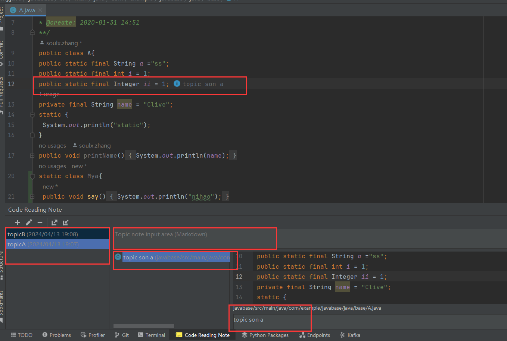

# Code Reading Mark Note Pro

**Based on the open source project [ CodeReadingNote](https://github.com/kitabatake/CodeReadingNote): Direct compatibility (基于开源项目[ CodeReadingNote](https://github.com/kitabatake/CodeReadingNote)：直接兼容)**

## TODO
- Function: topic layering (功能topic分层)

## Borrowed from (借鉴)
@xoyojank fixed the error that occurred every time CodeReadingNote was opened (@xoyojank 修复了每次打开CodeReadingNote报错问题)

## Usage Tips (使用提示)
- Shortcut setting example: Settings → Keymap → "Add to Topic" shortcut customization (快捷键设置示例：设置 → 快捷键 → "Add to Topic" 自定义)
- The experimental function's mark position fix works best with "restore workspace when switching branches" unchecked (实验功能的mark位置修复最好搭配取消勾选"restore workspace when switching branches")

## Project Background (项目背景)
Why create this project? The original open source project has not been maintained for a long time, has no new features and does not support higher versions. (为什么建立该项目？原开源项目长期没有维护，没有新功能且高版本不支持。)

Expectation: Co-maintenance, welcome PR, Issues, ongoing maintenance (期望：共同维护，欢迎PR、Issues、持续维护)

## Feature List (功能列表)

### Core Features (核心功能)
- Three-level hierarchy: Topic → Group → TopicLine with collapsible folding (三级层次：Topic → Group → TopicLine，支持折叠收缩)
- Code line bookmarking: Link code lines with notes and bookmarks (代码行书签：将代码行与备注和书签关联)
- Intelligent search: Pinyin and fuzzy matching for Topics and Bookmarks (智能搜索：支持拼音和模糊匹配，适用于Topics和Bookmarks)
- Auto-following line numbers: Annotations follow text changes automatically (自动跟随行号：备注自动跟随文本变化)
- Search navigation: Double-click to jump to code, right-click context menu (搜索导航：双击跳转代码，右键上下文菜单)

### Pro Enhanced Features (Pro增强功能)
- Higher IntelliJ IDEA version support (支持更高版本IntelliJ IDEA)
- Advanced grouping: Tag grouping, topic notes, sub-topic notes, custom naming (高级分组：标签分组、主题笔记、子题笔记、自定义命名)
- Code remarks display: Show codeRemark annotations (代码备注展示：显示codeRemark注解)
- Native bookmarks integration: Link with IntelliJ native bookmarks (原生书签联动：与IntelliJ原生书签联动)
- Position fixing: Experimental feature to fix bookmark position shifts (位置修复：实验性功能修复书签位置偏移)
- Third-party synchronization: GitHub repository sync for cross-device collaboration (第三方同步：GitHub仓库同步，实现跨设备协作)
- Multi-language support: Independent English/Chinese interface switching (多语言支持：插件独立英文/中文界面切换)

## Display (展示)
