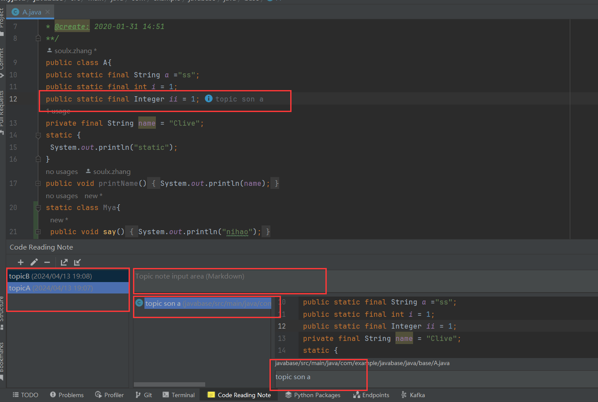

[中文](./README.md)

Based on the open source project [ CodeReadingNote](https://github.com/kitabatake/CodeReadingNote): Compatible with this plugin
- todo
  - function：topic layering
    Borrowed from: @xoyojank fixed it every time you open the CodeReadingNote error problems

- Why build this project?
  - Why create this project? The original open source project, not maintained for a long time, no new features and higher versions are not supported.
  - Expectation: joint maintenance, welcome pr, issues, continuous maintenance
- Expectation: Co-maintenance, welcome pr, issues, ongoing maintenance.
  - support for IntelliJ IDEA higher versions (pro added)
  - support for tag grouping, topic notes and sub-topic notes, easy to refine the code query
  - Support customized naming of grouped lists (added by pro)
  - Support codeRemark code notes display (New in pro)
- 展示如下
  - 
